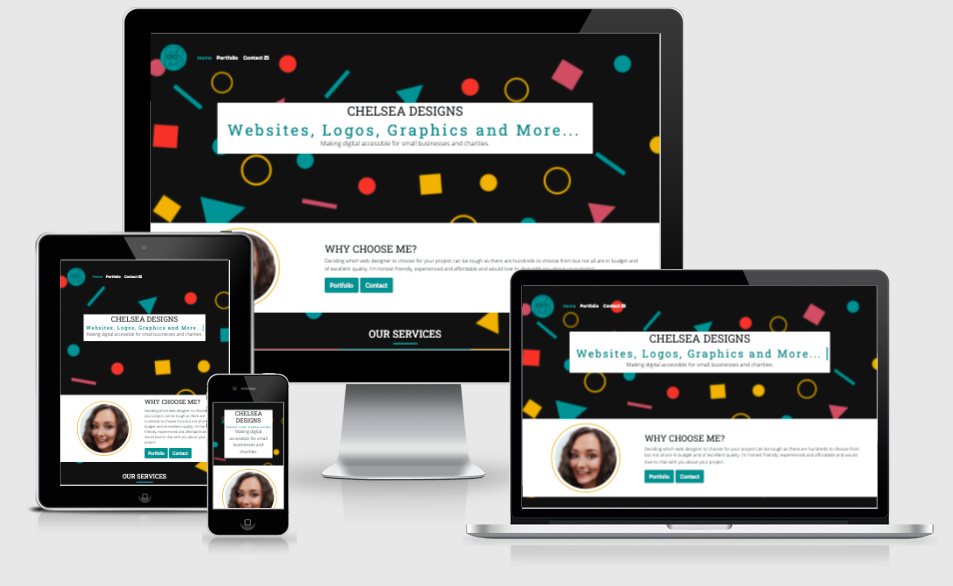
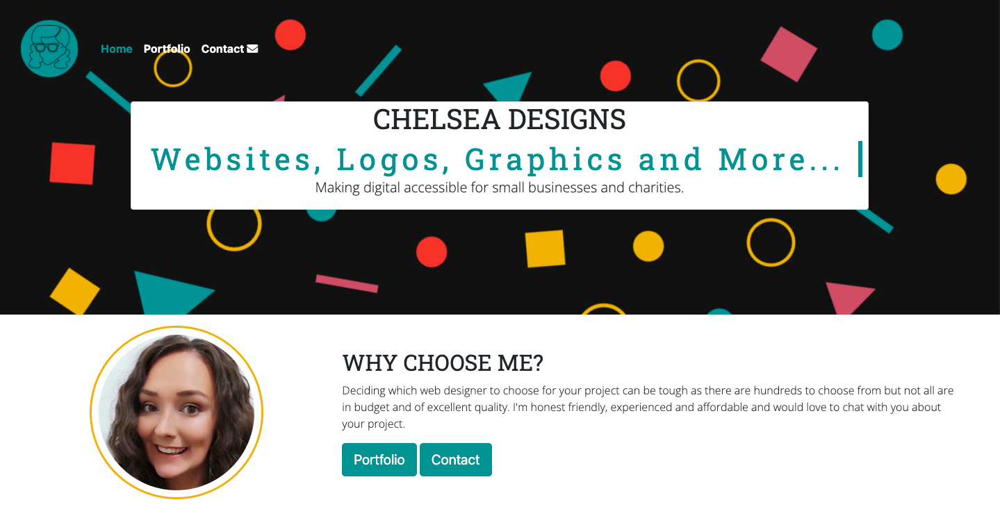
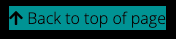
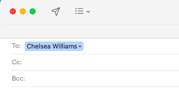

<h1 align="center">Chelsea Designs Website</h1>

[View the live project here.](https://chelsea-designs.github.io/first-milestone/)

This is the main marketing website for Chelsea Designs. Chelsea Designs is a web and graphics design company targeting small businesses, creative businesses and charities. It is designed to be responsive and accessible on a range of devices, making it easy to navigate for potential clients.

## User Experience (UX)

-   ### User stories

    -   #### First Time Visitor Goals

        1. As a First Time Visitor, I want to easily understand the main services of the website and learn more about the business.
        2. As a First Time Visitor, I want to be able to easily be able to navigate throughout the site to find content.
        3. As a First Time Visitor, I want to establish trust with the brand.

    -   #### Returning Visitor Goals

        1. As a Returning Visitor, I want to look for previous work to see their quality of work.
        2. As a Returning Visitor, I want to find the best way to get in contact with the business with any questions I may have.

-   ### Design
    -   #### Colour Scheme
        -   The four main colours used are blue #419092, yellow #e9b02f, red #e24e42 and pink #c05b6b.
    -   #### Typography
        -   The Open Sans is the main font used throughout the whole website with Serif as the fallback font in case for any reason the font isn't being imported into the site correctly. Roboto Slab is used for headings as it pairs nicely with the Open Sans font.
    -   #### Imagery
        -   Imagery is important. The large, background hero image is designed to be striking and catch the user's attention. It also has a vibrant, geometric, energetic aesthetic. Imagery shouldn't be clinical/sterile as the target audience is small business and charities rather than big corporations.

### Wireframes

Wireframes for mobile, tablet and desktop have been made for all page:

-   Home Page Wireframe - [View](https://share.balsamiq.com/c/4qkFdcdVk9MTgrF18pRK3g.png)

-   Portfolio Page Wireframe - [View](https://share.balsamiq.com/c/2uUgy7BGFEdsLKdJduzgLu.png)

-   Services Page Wireframe - [View](https://share.balsamiq.com/c/pVMj9GmJ1GNx5ipv3rgTip.png)

-   Contact Us Page Wireframe - [View](https://share.balsamiq.com/c/th9Gw9SCheMVvAViKWSTx3.png)

## Features

### Existing Features

-   Responsive - on all device sizes

-   Interactive elements - accordions (faqs), dropdown menus, buttons, and contact forms.

-   Back to top link - this helps to improve navigation and user experience.

-   Social media links - provides links to social media platforms to help establish trust with the user.

-   Navigation - Navbar with drop down and collapsible to improve user experience through easy navigation on various devices.

-   Client testimonials - to display previous client feedback and establish trust with users.

### Future Features

-   Tweak logo portfolio to have a tidier end regardless of how many images are included in the portfolio, I would do this using Javascript. This would mean I could continue to add more logos and maintain a clear and tidy appearance to the portfolio. 

-   In the future each of the services would link to their own separate page (from dropdown menu) for more in depth details of what each service includes. This was beyond the scope of this first project.

-   Testimonial replaced with testimonials carousel to display more than one client quote without taking too much display space.

-   Make the form functional after completing the relevant modules on the Full Stack Developer Course.

-   Include a blog for project write ups and business content to improve SEO.

## Technologies Used

### Languages Used

-   [HTML5](https://en.wikipedia.org/wiki/HTML5)
-   [CSS3](https://en.wikipedia.org/wiki/Cascading_Style_Sheets)

### Frameworks, Libraries & Programs Used

1. [Bootstrap 5.1.3:](https://getbootstrap.com/docs/5.1/getting-started/introduction/)
    - Bootstrap was used to assist with the responsiveness and styling of the website.
1. [Google Fonts:](https://fonts.google.com/)
    - Google fonts were used to import the 'Open Sans' and 'Roboto Slab' fonts into the style.css file which is used on all pages throughout the project.
1. [Font Awesome:](https://fontawesome.com/)
    - Font Awesome was used on all pages throughout the website to add icons for aesthetic and UX purposes.
1. [Git](https://git-scm.com/)
    - Git was used for version control by utilising the Gitpod terminal to commit to Git and Push to GitHub.
1. [GitHub:](https://github.com/)
    - GitHub is used to store the projects code after being pushed from Git.
1. [Affinity Photo:](https://affinity.serif.com/en-gb/photo/#buy)
    - Affinity Photo was used to create the logo, background imagery, resizing images and editing photos for the website.
1. [Google Dev Tools:](https://developers.google.com/web/tools)
    - Google Chrome Dev Tools was used to inspect the code throughout the design process at different device sizes (in responsive mode).

## Testing

### Manual Testing
In order to test navigation I verified the following:
- Does the footer button link to the correct page? 
- Does the menu collapse on smaller devices?
- Does each link on the navbar point to the correct page?
- Does the 'Back to top' link scroll to the top on every page?
- Do all buttons link to their correct locations?

In order to test the form I verified the following:
- Does the completed form display the Code Institute form dump?
- Do all form inputs display on the Code Institute form dump?
- Is the user prompted to complete fields with missing inputs?

In order to test the external social links I verified the following:
- Do the social icons change colour on hover?
- Do the social sites open in a new tab?
- Do the social icons link to the correct urls when opened?

### Final Testing

The W3C Markup Validator and W3C CSS Validator Services were used to validate every page of the project to ensure there were no syntax errors in the project. Google Lighthouse function used to test performance, accessibility and best practices. Contrast Grid was used to check colour scheme contrast for accessibility and clarity for users. Wave was used to check accessibility and aria-labels.

-   [W3C Markup Validator](https://validator.w3.org/nu/#textarea) - [Results](assets/images/testing/markup-validator.png)
-   [W3C CSS Validator](https://jigsaw.w3.org/css-validator/#validate_by_input) - [Results](assets/images/testing/css-validator.png)
-   [Lighthouse](https://developers.google.com/web/tools/lighthouse) - [Results](assets/images/testing/lighthouse.png)
-   [Contrast Grid](https://contrast-grid.eightshapes.com/?version=1.1.0&background-colors=&foreground-colors=%23FFFFFF%2C%20White%0D%0A%23F2F2F2%0D%0A%23DDDDDD%0D%0A%23CCCCCC%0D%0A%23888888%0D%0A%23404040%2C%20Charcoal%0D%0A%23000000%2C%20Black%0D%0A%232F78C5%2C%20Effective%20on%20Extremes%0D%0A%230F60B6%2C%20Effective%20on%20Lights%0D%0A%23398EEA%2C%20Ineffective%0D%0A&es-color-form__tile-size=compact&es-color-form__show-contrast=aaa&es-color-form__show-contrast=aa&es-color-form__show-contrast=aa18&es-color-form__show-contrast=dnp) - [Results](assets/images/testing/contrast-grid.png)
-   [Wave.Webaim.org](https://wave.webaim.org/) - [Results](assets/images/testing/wave-webaim.png)

### Testing User Stories from User Experience (UX) Section

-   #### First Time Visitor Goals

    1. As a First Time Visitor, I want to easily understand the main services of the business and learn more about the business.

        1. Upon entering the site, users are automatically greeted with an eye catching hero image. The main points are made immediately with the hero image text.
        2. The lower half of the viewport displays the 'about' section which gives the user the opportunity to learn more about the business.
        
        3. Services overview displayed on homepage.
        

    2. As a First Time Visitor, I want to be able to easily be able to navigate throughout the site to find content.

        1. The site has been designed to be fluid and never to entrap the user. At the top of each page there is a clean and responsive navigation bar, each link describes what page they will end up at clearly.
        
        2. At the bottom of all pages there is a button in the footer so that the user has something to do/another page to visit.
        
        3. Alternatively, the user can press the Back to Top link in the footer to return to the top of the page.
        

    3. As a First Time Visitor, I want to establish trust with the brand.
        1. Once the new visitor has read the Why choose us/About section, they will notice the portfolio button to see the high quality of previously completed work.
        
        2. The user can also scroll to the bottom of any page on the site to locate social media links in the footer.
        
        3. At the bottom of the home page, the user is shown a carousel of client testimonials to help establish trust.
        

-   #### Returning Visitor Goals

    1. As a Returning Visitor, I want to look for previous work to see their quality of work.

        1. There is a portfolio button displayed straight after the about section.
        
        2. They will be directed to a portfolio page from main nav bar.
        
        3. Portfolio of previous web and logo designs clearly shown.
        

    2. As a Returning Visitor, I want to find the best way to get in contact with the business with any questions I may have.

        1. The navigation bar clearly highlights the "Contact" page with an icon next to it to help it to stand out.
        
        2. Every page has a contact button in footer.
        
        3. The footer contains links to the business' social media channels as well as the business' email and phone number.
        
        4. Whichever link they click, it will be open up in a new tab to ensure the user can easily get back to the website.
        
        5. Easy to use, clear contact form on the contact page.
        
        6. The email button is set up to automatically open up your email app and autofill email address in the "To" section.
        
        7. The phone button is set up to automatically open their call app and auto dial the business number.
        

### Further Testing

-   The website was tested on Google Chrome, Internet Explorer, Microsoft Edge and Safari browsers.
-   The website was viewed on a variety of devices such as MacBook, Android Redmi Note 9 Pro, iPhoneSE & iPhone11.
-   Friends and family members were asked to review the site and documentation to point out any bugs and/or user experience issues.

### Solved Bugs
1.  Inteded outcome: A black background behind the mobile toggler menu
    Problem: Background appears behind navbar on tablet screens.
    What I did to fix it: changed media query from max-width:600 to max-width:575.
    
    
2.  Inteded outcome: Responsive choose me section
    Problem: On smaller devices, headshot is centered while text is off to the left.
    What I did to fix it: Text div had class col-lg-10 instead of col-lg-8 and because of this was wrapping over to next line.
    
    
3.  Inteded outcome: Mobile friendly, non-cluttered, footer.
    Problem: Social media links list wrapped 2 icons to next line and footer looked cluttered on smaller screens.
    What I did to fix it: Opted for a column/vertical footer instead of horizontal layout.
    
    
4.  Inteded outcome: Eye catching website portfolio
    Problem: Friend who tested site for user experience skipped the portfolio as they assumed it was an ad banner.
    What I did to fix it: Added margins to website portfolio cards to break up the shape and make it look less banner sized.
    
    
5.  Inteded outcome: Buttons which contrast with footer before and after hover.
    Problem: When hovering over the footer button it blends into background.
    What I did to fix it: Inverted the background, border and text colours.
    
    
6.  Inteded outcome: Clear navigation bar
    Problem: Hard to see navigation text over some background shapes
    What I did to fix it: Changed navbar font to be bright white and added small black shadow behind text to act as an outline and help to stand out against hero image.
    
    

### Known Bugs

-   The logo portfolio would look better if the bottom row was full and all images aligned at the bottom, this section could be improved with the use of Javascript.
-   Fixed backgrounds are not yet compatible with iOS devices so appear enlarged and pixelated.

## Deployment

### GitHub Pages

The project was deployed to GitHub Pages using the following steps...

1. Log in to GitHub and locate the [GitHub Repository](https://github.com/)
2. At the top of the Repository (not top of page), locate the "Settings" Button on the menu.
3. Scroll down the Settings page until you locate the "Pages" Section.
4. Under "Source", click the dropdown called "None" and select "Main".
5. The page will automatically refresh.
6. At the top of the 'Pages' section, look to locate the now published site [link](https://chelsea-designs.github.io/first-milestone/).

### Forking the GitHub Repository

By forking the GitHub Repository we make a copy of the original repository on our GitHub account to view and/or make changes without affecting the original repository by using the following steps...

1. Log in to GitHub and locate the [GitHub Repository](https://github.com/chelsea-designs/first-milestone)
2. At the top of the Repository (not top of page) just above the "Settings" Button on the menu, locate the "Fork" Button.
3. You should now have a copy of the original repository in your GitHub account.

### Making a Local Clone

1. Log in to GitHub and locate the [GitHub Repository](https://github.com/chelsea-designs/first-milestone)
2. Next to the green Gitpod button, to the left, locate the "Code" button and click.
3. To clone the repository using HTTPS, under "Clone with HTTPS", copy the link.
4. Open Git Bash
5. Change the current working directory to the location where you want the cloned directory to be made.
6. Type `git clone`, and then paste the URL you copied in Step 3.
7. Press Enter. Your local clone will be created.

## Credits

### Code

-   [Bootstrap5](https://getbootstrap.com/docs/5.1/getting-started/introduction/): Bootstrap Library used throughout the project mainly to make site responsive using the Bootstrap Grid System. Also, code was used from the Bootstrap Components Library for dropdown menu, buttons and accordions etc.

-   The typewriting effect code came from this website [CSS-Tricks](https://css-tricks.com/snippets/css/typewriter-effect/). I tweaked the code to suit my design aesthetic.

-   The code used to create the logo portfolio came from [this post](https://medium.com/swlh/3-easy-css-only-masonry-layouts-acfb64364ad6). It was tweaked to use only square images, and to use my own imagery.

### Content

-   All content was written by myself.

### Media

-   Images displaying website design across devices generated by [AmIResponsive](http://ami.responsivedesign.is/)

-   Images for client testimonials used with permission from individuals.

-   All graphics were created by myself.

### Acknowledgements

-   My mentor for helpful feedback.

-   Tutor support at Code Institute for their support.

-   My peers for their support through Stack.
